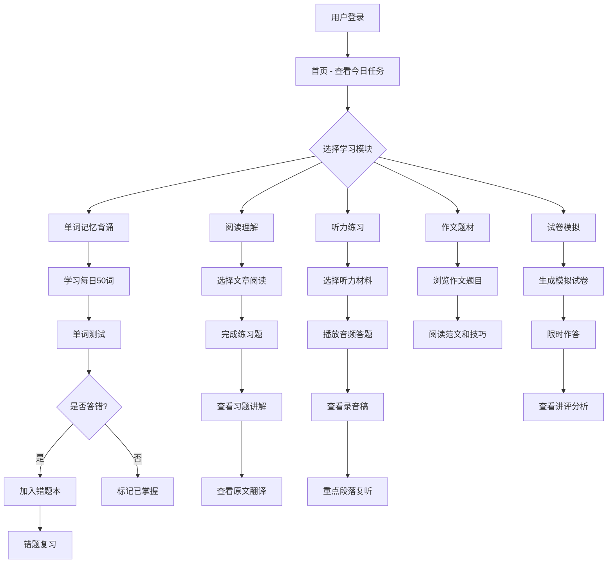

# CET-4 英语四级学习平台 — 产品需求文档（PRD）

## 1. 产品概述

CET-4 英语四级学习平台是一款面向备考大学英语四级考试学生的综合性在线学习网站，提供单词记忆背诵、阅读理解、听力练习、作文题材和试卷讲评与生成等核心功能，帮助考生系统性备考。

- 目标用户：准备参加大学英语四级考试的大学生及社会考生
- 核心价值：一站式备考平台，覆盖四级考试全部题型，提供错题追踪、题目讲解、原文翻译等深度学习辅助功能

## 2. 核心功能

### 2.1 用户角色

| 角色 | 注册方式 | 核心权限 |
|------|----------|----------|
| 普通用户 | 邮箱/手机号注册 | 浏览并使用所有学习功能、查看学习进度、管理错题本 |
| 游客 | 无需注册 | 浏览首页、体验部分免费内容 |

### 2.2 功能模块

1. **首页**：学习概览、每日推荐、学习进度统计、快捷入口
2. **单词记忆背诵页**：每日50词学习卡片、错题本、词汇检索、进度追踪
3. **阅读理解页**：文章列表、阅读练习、习题讲解、原文翻译
4. **听力练习页**：听力列表、音频播放、录音稿查看、复听功能
5. **作文题材页**：作文题目库、范文展示、写作技巧
6. **试卷讲评与生成页**：模拟试卷生成、试卷讲评、成绩分析
7. **个人中心页**：学习统计、错题汇总、收藏管理

### 2.3 页面详情

| 页面名称 | 模块名称 | 功能描述 |
|----------|----------|----------|
| 首页 | Hero横幅区 | 展示平台标语、学习激励信息、快捷开始按钮 |
| 首页 | 学习数据看板 | 今日学习进度、累计学习天数、错题数量统计 |
| 首页 | 每日推荐区 | 每日单词推荐、每日阅读推荐、每日听力推荐 |
| 首页 | 快捷入口导航 | 各模块快速跳转入口卡片 |
| 单词记忆背诵页 | 每日单词卡 | 每日50词卡片翻转学习，显示音标、释义、例句 |
| 单词记忆背诵页 | 单词测试 | 对当日学习的单词进行拼写和释义测试 |
| 单词记忆背诵页 | 错题本 | 收集用户答错的单词，支持复习和重新测试 |
| 单词记忆背诵页 | 词汇检索 | 4900+词汇的搜索和筛选功能 |
| 单词记忆背诵页 | 进度追踪 | 显示已学/未学/已掌握词汇数量和比例 |
| 阅读理解页 | 文章列表 | 200+篇阅读文章列表，按主题和难度分类 |
| 阅读理解页 | 阅读练习 | 文章阅读和题目作答界面，计时功能 |
| 阅读理解页 | 习题讲解 | 完成后展示每题的详细解析和答题思路 |
| 阅读理解页 | 原文翻译 | 提供文章的中文全文翻译，逐段对照 |
| 听力练习页 | 听力列表 | 100+篇听力材料列表，按类型和难度分类 |
| 听力练习页 | 音频播放器 | 支持播放、暂停、进度拖拽、倍速播放 |
| 听力练习页 | 听力练习题 | 听力理解题目作答界面 |
| 听力练习页 | 录音稿查看 | 播放结束后可查看完整听力录音稿 |
| 听力练习页 | 复听功能 | 可按句子或段落重新播放指定片段 |
| 作文题材页 | 作文题目库 | 50+作文题目列表，按类型分类（议论文、说明文等） |
| 作文题材页 | 范文展示 | 每道题目提供高分范文，含批注点评 |
| 作文题材页 | 写作技巧 | 分类展示写作模板、常用句型、过渡词等 |
| 试卷讲评与生成页 | 试卷生成器 | 可选择题型和数量组合生成模拟试卷 |
| 试卷讲评与生成页 | 模拟考试 | 限时作答完整试卷，模拟真实考试环境 |
| 试卷讲评与生成页 | 试卷讲评 | 提交后展示各题型详细解析和评分 |
| 试卷讲评与生成页 | 成绩分析 | 按题型分析得分率，给出薄弱项建议 |
| 个人中心页 | 学习统计 | 累计学习时长、各模块完成情况图表 |
| 个人中心页 | 错题汇总 | 所有模块的错题统一管理和复习 |
| 个人中心页 | 收藏管理 | 收藏的单词、文章、听力材料的快速访问 |

## 3. 核心流程

### 3.1 用户每日学习流程
用户登录后进入首页，查看今日学习任务和进度。根据推荐或自主选择进入各模块学习。在单词模块完成每日50词学习后进行测试，错题自动加入错题本。阅读和听力模块完成练习后查看讲解和翻译/录音稿。作文模块浏览题目和范文。定期生成模拟试卷进行自测。

### 3.2 流程图

## 4. 用户界面设计

### 4.1 设计风格

- **主色调**：深海蓝 (#1B3A5C) 作为主色，象征知识深度；活力橙 (#FF6B35) 作为强调色，激励学习动力
- **辅助色**：浅灰蓝 (#E8EDF2) 背景色，纯白 (#FFFFFF) 卡片色，柔绿 (#4CAF50) 正确状态色，柔红 (#F44336) 错误状态色
- **按钮风格**：圆角矩形按钮（8px），主按钮实心填充，次要按钮描边
- **字体**：中文使用思源黑体，英文使用 Poppins，标题 24px/20px，正文 14px，辅助 12px
- **布局风格**：左侧固定导航栏 + 右侧内容区，卡片式模块布局
- **图标风格**：线性图标（Lucide），统一 20px 尺寸

### 4.2 页面设计概览

| 页面名称 | 模块名称 | UI元素 |
|----------|----------|--------|
| 首页 | Hero横幅区 | 渐变背景，大标题+副标题，CTA按钮，微动画 |
| 首页 | 学习数据看板 | 圆形进度条，数字统计卡片，轻量阴影 |
| 首页 | 每日推荐区 | 横向滚动卡片，悬浮缩放效果 |
| 首页 | 快捷入口导航 | 图标+文字网格卡片，悬浮发光边框 |
| 单词记忆背诵页 | 每日单词卡 | 3D翻转卡片效果，正面英文/背面中文+例句 |
| 单词记忆背诵页 | 单词测试 | 四选一选择题，正确/错误颜色反馈动画 |
| 单词记忆背诵页 | 错题本 | 列表+标签筛选，错误次数标记 |
| 单词记忆背诵页 | 词汇检索 | 搜索框+字母索引+筛选器 |
| 单词记忆背诵页 | 进度追踪 | 环形进度图+日历热力图 |
| 阅读理解页 | 文章列表 | 卡片列表，标签分类，难度星级 |
| 阅读理解页 | 阅读练习 | 左右分栏：左侧文章+右侧题目，顶部计时器 |
| 阅读理解页 | 习题讲解 | 答案高亮+解析展开面板 |
| 阅读理解页 | 原文翻译 | 双语对照，逐段切换/并排模式 |
| 听力练习页 | 听力列表 | 卡片列表，时长标签，难度标记 |
| 听力练习页 | 音频播放器 | 底部固定播放器，波形进度条，倍速按钮 |
| 听力练习页 | 录音稿查看 | 文字稿+当前播放句子高亮 |
| 听力练习页 | 复听功能 | 句子级点击复听，段落循环播放 |
| 作文题材页 | 作文题目库 | 卡片列表，类型标签，难度标记 |
| 作文题材页 | 范文展示 | 范文全文+侧边批注，关键句高亮 |
| 作文题材页 | 写作技巧 | 手风琴展开面板，代码式模板展示 |
| 试卷讲评与生成页 | 试卷生成器 | 拖拽式题型选择+数量调节器 |
| 试卷讲评与生成页 | 模拟考试 | 全屏模式，顶部倒计时，底部题号导航 |
| 试卷讲评与生成页 | 试卷讲评 | 各题型解析Tab，正误统计饼图 |
| 试卷讲评与生成页 | 成绩分析 | 雷达图+柱状图，薄弱项红色标注 |
| 个人中心页 | 学习统计 | 折线图+日历热力图 |
| 个人中心页 | 错题汇总 | 多Tab分类，一键复习按钮 |
| 个人中心页 | 收藏管理 | 收藏卡片列表，取消收藏交互 |

### 4.3 响应式设计

- 桌面优先设计，最小宽度 1024px
- 平板适配（768px-1024px）：导航栏折叠为顶部汉堡菜单，内容区自适应
- 移动端适配（<768px）：单列布局，底部Tab导航，触摸优化按钮尺寸（最小44px）
