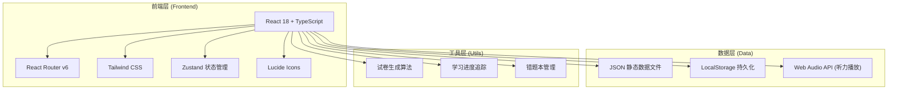
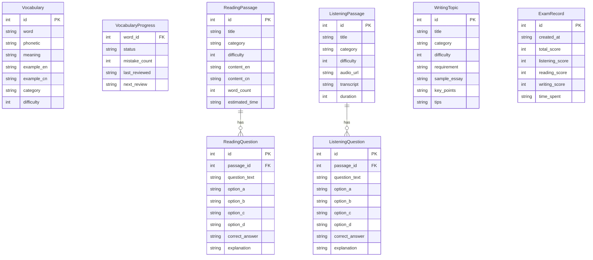

# CET-4 英语四级学习平台 — 技术架构文档

## 1. 架构设计

## 2. 技术说明

- **前端框架**：React 18 + TypeScript + Vite
- **初始化工具**：vite-init (react-ts 模板)
- **样式方案**：Tailwind CSS 3 + CSS Modules (局部覆盖)
- **状态管理**：Zustand（全局学习状态）+ LocalStorage（数据持久化）
- **路由**：React Router DOM v6
- **图标**：Lucide React
- **后端**：无后端服务，全部使用前端静态数据 + LocalStorage 持久化
- **音频处理**：Web Audio API + HTML5 Audio Element

## 3. 路由定义

| 路由 | 用途 |
|------|------|
| `/` | 首页，展示学习概览和快捷入口 |
| `/vocabulary` | 单词记忆背诵主页，展示每日任务和进度 |
| `/vocabulary/learn` | 每日50词学习界面 |
| `/vocabulary/quiz` | 单词测试界面 |
| `/vocabulary/mistakes` | 错题本界面 |
| `/vocabulary/search` | 词汇检索界面 |
| `/reading` | 阅读理解列表页 |
| `/reading/:id` | 阅读练习详情页（文章+题目） |
| `/reading/:id/explanation` | 习题讲解和原文翻译页 |
| `/listening` | 听力练习列表页 |
| `/listening/:id` | 听力练习详情页（音频+题目） |
| `/listening/:id/transcript` | 录音稿查看页 |
| `/writing` | 作文题材主页 |
| `/writing/:id` | 作文题目详情（范文+技巧） |
| `/exam` | 试卷讲评与生成主页 |
| `/exam/generate` | 试卷生成配置页 |
| `/exam/take` | 模拟考试作答页 |
| `/exam/review/:id` | 试卷讲评详情页 |
| `/profile` | 个人中心 |

## 4. 数据模型

### 4.1 数据模型定义

### 4.2 数据存储策略

- **静态数据**：单词库(4900+)、阅读文章(200+)、听力材料(100+)、作文题目(50+) 存储为 JSON 文件
- **用户数据**：学习进度、错题本、收藏、考试记录 存储在 LocalStorage
- **数据分片**：大容量数据按首字母/分类分片加载，避免首屏性能问题

## 5. 关键技术方案

### 5.1 单词每日更新机制
- 基于用户注册日期和当前日期计算学习天数
- 根据学习天数从4900词库中按序取50词作为当日任务
- 支持手动调整学习进度（补学/跳过）

### 5.2 错题本机制
- 单词、阅读、听力模块的错误自动收集
- 按艾宾浩斯遗忘曲线推荐复习时间
- LocalStorage 持久化错题数据

### 5.3 听力播放方案
- 使用 HTML5 Audio 元素进行基础播放
- Web Audio API 实现波形可视化和倍速播放
- 句子级时间戳实现精准复听定位
- 录音稿与音频时间轴同步高亮

### 5.4 试卷生成算法
- 用户选择题型和数量后，从题库随机抽取
- 支持按难度筛选（简单/中等/困难）
- 确保同一试卷不重复出题
- 生成结果缓存到 LocalStorage

### 5.5 数据加载优化
- 大数据集采用分页/虚拟滚动
- 按需加载：阅读文章详情页进入时才加载全文和题目
- 图片/音频资源懒加载
